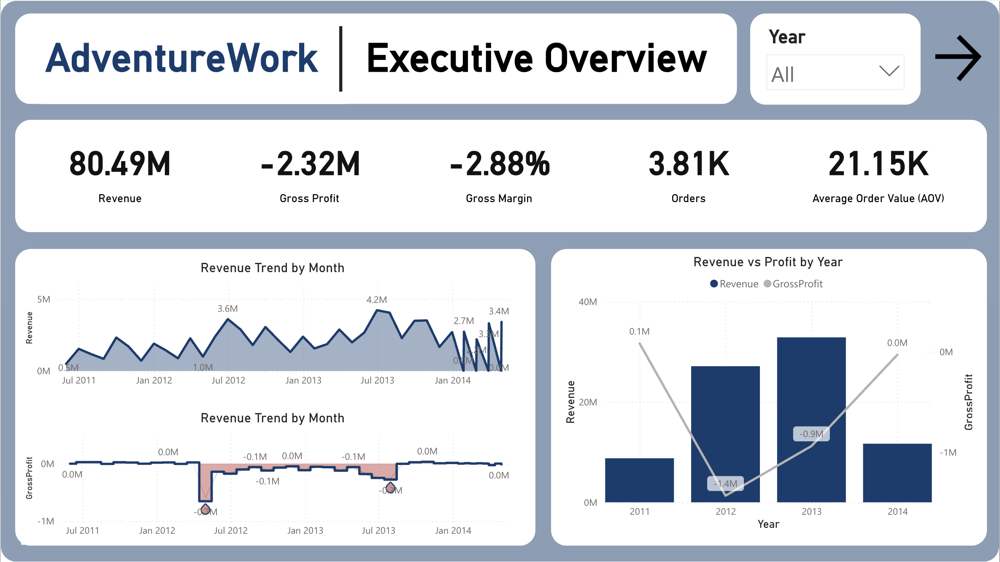
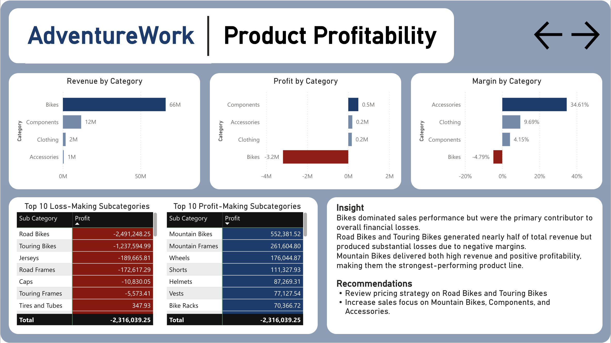
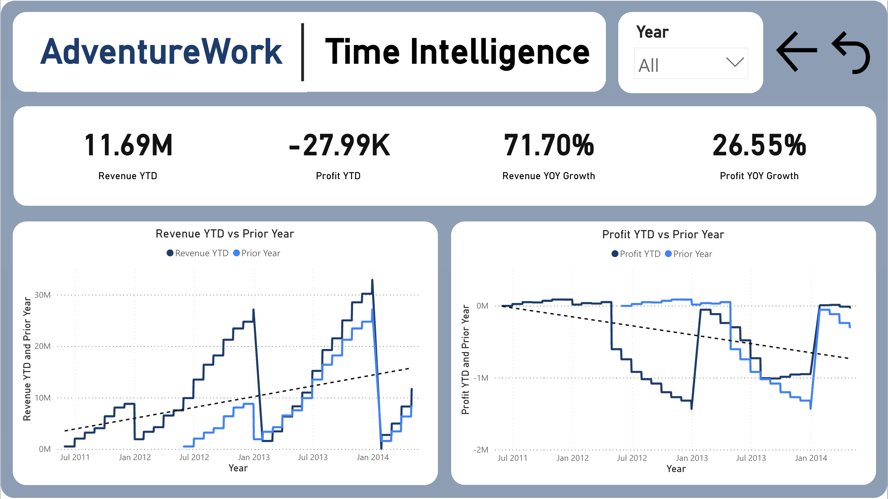

# Financial Performance Analysis
### AdventureWork | SQL | Power BI | DAX | Excel | Python

## 1. Overview
Analyzed AdventureWork sales and product data to evaluate financial performance, uncover loss-making product lines, and identify the key drivers behind declining profitability over time.

## 2. Business Problem
The business was generating substantial revenue, but profitability was not consistent across product categories and time periods.  
This project was designed to answer the following stakeholder questions:

- How much revenue, profit, and order volume did the business generate overall?
- How did financial performance change over time by year and month?
- Which product categories and sub-categories were driving profit, and which were causing losses?
- How did current-year performance compare with prior periods?
- What actions should the business take to improve profitability while maintaining revenue growth?

---

## 3. Tools & Process

### SQL
- Joined transactional order data with product, subcategory, and category tables
- Built KPI summaries for revenue, profit, orders, customers, and quantity sold
- Analyzed revenue and profit by category and sub-category
- Investigated loss-making product groups and profitability drivers
- Prepared aggregated outputs to support dashboard development and business interpretation

### Python
- Used for basic data inspection before analysis, including checking table structure, data types, missing values, duplicates, and summary statistics

### Power BI
- Built a star schema using fact and dimension tables
- Created DAX measures for Revenue, Cost, Gross Profit, Gross Margin %, Average Order Value, YTD metrics, and prior-year comparisons
- Designed a multi-page dashboard to track executive KPIs, category profitability, product-level performance, and monthly financial trends
- Applied time intelligence to evaluate performance over time and compare current results with previous periods

---

## 4. Key Findings

- The business generated **$80.49M in revenue** from **60,919 order lines**, with an **average order value of $21.15K**.
- Despite strong revenue, the business recorded an overall **loss of -$2.32M**, indicating that sales growth was not translating into healthy profitability.
- **Bikes** dominated the business, contributing **$66.33M in revenue**, but also generated a **-$3.18M loss**, making it the primary driver of the company’s negative profit.
- **Components**, **Clothing**, and **Accessories** were all profitable, but their combined profit contribution was not large enough to offset the losses from Bikes.
- At the sub-category level, **Road Bikes** and **Touring Bikes** were the largest loss-making product groups, generating combined losses of more than **$3.7M**.
- Additional loss-making sub-categories included **Jerseys**, **Road Frames**, **Caps**, and **Touring Frames**, suggesting that profitability issues extended beyond a single product line.
- On the positive side, **Mountain Bikes** generated the highest sub-category profit at approximately **$552K**, while **Mountain Frames** also delivered positive contribution.
- Time-based analysis showed that financial performance varied significantly by year, reinforcing the importance of tracking revenue and profit trends over time rather than relying on total sales alone.

---

## 5. Dashboard Preview

### Interactive Dashboard

Explore the live Power BI dashboard here:

[Open Interactive Power BI Dashboard](https://app.powerbi.com/reportEmbed?reportId=53f1b965-c43b-4072-af06-cb06126866c5&autoAuth=true&ctid=fe3fbfc3-740c-40d3-a502-14423e1ca052&actionBarEnabled=true)

### Executive Overview


### Product Profitability


### Time Intelligence


---

## 6. Recommendations

### 1) Investigate the profitability structure of Bikes
Although Bikes generated the majority of revenue, the category was also the largest source of loss. The business should review:
- pricing strategy
- production or sourcing cost structure
- discounting practices if applicable
- whether certain bike product lines are being sold at unsustainable margins

### 2) Prioritize turnaround actions for Road Bikes and Touring Bikes
These sub-categories were the largest loss drivers in the portfolio. Management should evaluate whether margins can be improved through cost reduction, price optimization, product redesign, or SKU rationalization.

### 3) Protect and scale profitable categories
Categories such as **Components**, **Clothing**, and **Accessories** were profitable and may represent more sustainable growth areas. The business should identify which products within these categories can be expanded without materially increasing cost pressure.

### 4) Use time intelligence to monitor financial health continuously
Since performance changed over time, management should track **monthly revenue, monthly profit, YTD performance, and prior-year comparisons** on a recurring basis. This helps detect margin deterioration earlier rather than waiting for annual results.

### 5) Monitor revenue and profit together, not revenue alone
This project showed that high sales can mask serious profitability issues. Future financial reporting should consistently track **revenue, cost, profit, and gross margin together** at both category and sub-category levels.

---

## 7. Project Structure

```text
financial-performance-analysis/
│
├─ README.md
├─ sql/
│  ├─ financial_kpis.sql
│  ├─ category_profitability.sql
│  ├─ subcategory_profitability.sql
│  ├─ yearly_profit_trend.sql
│  ├─ monthly_profit_trend.sql
│  ├─ top_loss_products.sql
│  └─ top_profit_products.sql
│
├─ powerbi/
│  └─ financial_performance_dashboard.pbix
│
├─ assets/
│  ├─ dashboard-overview.png
│  ├─ product-profitability.png
│  └─ time-intelligence.png
│
└─ docs/
   ├─ star_schema.md
   └─ dax_measures.md
```

---

## 8. Skills Demonstrated
- SQL joins and aggregation
- Python basic data inspection
- Product and category profitability analysis
- Financial KPI development
- Power BI dashboard design
- DAX measures and time intelligence
- Root cause analysis and business recommendations
